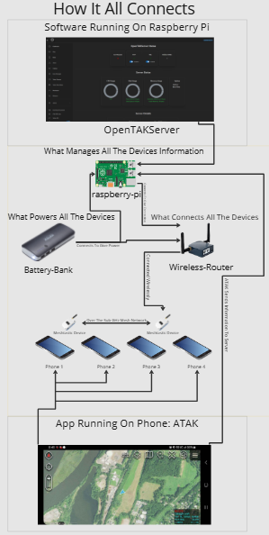

# BlackBook
This Project creates a decentralize communication, while being able to communicate with teams and being able to see each other in a map 

# Table of Contents

- [Project Overview](#project-overview)
- [Hardware Needed](#hardware-needed)
- [Optional Hardware](#optional-hardware)
- [Software Needed](#software-needed)
- [System Overview](#system-overview)
- [Setting Up OpenTAK Server](#setting-up-opentak-server)
- [Flashing the Meshtastic Device](#flashing-the-meshtastic-device)
- [Setting Up Meshtastic for the Server](#setting-up-meshtastic-for-the-server)
- [Meshtastic ATAK Setup](#meshtastic-atak-setup)
- [Connecting ATAK to the Server Using SSL](#connecting-atak-to-the-server-using-ssl)
- [Server Diagram](#server-diagram)

# OpenTAK Server and Meshtastic Setup

## Project Overview

- This project documents the setup of an OpenTAK Server system using a Raspberry Pi 5, Meshtastic devices, ATAK, and a local wireless network. The goal of this setup is to create a portable communication and tracking system where ATAK devices can connect to an OpenTAK Server and share information through the network. The Raspberry Pi 5 is used to host OpenTAK Server. A mini wireless router provides the local network, and Meshtastic devices are used to support off-grid communication. ATAK is used on mobile devices to connect to the server, view shared location data, and communicate with other users on the system. This setup is useful for testing portable field communication, local team tracking, and server-based ATAK networking.

## Hardware Needed

| Hardware | Purpose | Link |
|---|---|---|
| Raspberry Pi 5 | Runs OpenTAK Server and manages connected ATAK clients | [Link to Buy](https://www.pishop.us/product/raspberry-pi-5-8gb/?src=raspberrypi) |
| Mini Wireless Router | Creates the local network used by the Raspberry Pi, ATAK devices, and Meshtastic gateway | [Link to Buy](https://www.amazon.com/dp/B07794JRC5?ref=ppx_yo2ov_dt_b_fed_asin_title) |
| Battery Bank | Powers the portable setup when wall power is not available | [Link to Buy](https://www.amazon.com/dp/B0DBG2D5DF?psc=1&pd_rd_i) |
| Meshtastic Device | Used for mesh communication and connection with the OpenTAK Server setup | [Link to Buy](https://www.amazon.com/ESP32-V3-Module-3000mAh-Battery/dp/B0D7HSHTNX?crid=1N6MK9LUGZFUP&dib=eyJ2IjoiMSJ9.Uf) |
| Phone or Tablet | Runs ATAK and connects to the OpenTAK Server | N/A |

## Software Needed

| Software | Purpose |
|---|---|
| OpenTAK Server | Main server used to manage ATAK connections and connected users |
| Ubuntu Desktop or Raspberry Pi OS | Operating system used on the Raspberry Pi 5 |
| Meshtastic Firmware | Firmware used on the Meshtastic device |
| Meshtastic Mobile App | Used to configure the Meshtastic device |
| ATAK | Android Team Awareness Kit app used for mapping, tracking, and communication |
| Meshtastic ATAK Plugin | Allows ATAK to work with Meshtastic devices |
| Web Browser | Used to access the OpenTAK Server Web UI |

## Server Diagram

The diagram below shows how the system connects together. The Raspberry Pi runs OpenTAK Server, the wireless router provides the local network, the battery bank powers the portable setup, and ATAK devices connect through the network.

